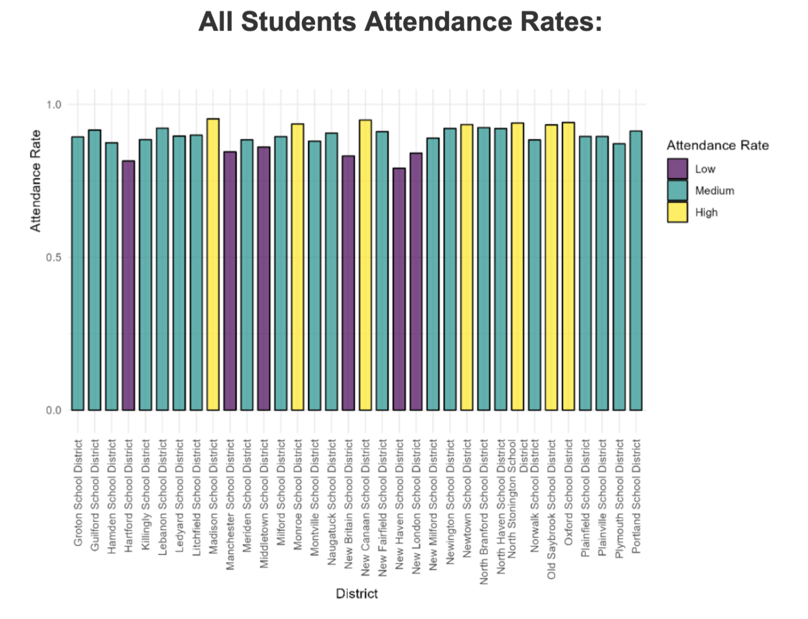

# FinalProject_INFO201
Project Final, INFO 201

For our final data analysis project, our group decided to hone in on attendance rates in school districts in Connecticut, along with the average SAT scores for those districts. We were able to retrieve these two data sets from data.gov, where information such as attendance percentages and numbers of students were listed for many different school years, along with the different "categories of students". These categories were then divided into smaller student "groups", such as students with disabilities, students on free/reduced meal plans, students of a colored race, etc. This allowed for us to individually take the attendance rates of these groups for the 2021-2022 school year. Going deeper into our analysis, we then combined a data set of the average SAT scores and we were able to create a scatter plot with a best fit line for these school districts. The most notable graphs we analyzed were as follows: 

The audience we aimed to reach here was both for parents and teachers alike. For parents, we hoped that they were able to look at our analysis and assist their decisions when choosing where to move and what district they would like to send their child in. For teachers, we hope that by looking at attendance rates for specific groups of students, they could understand those who may need more attention than others. Overall, this study had the goal of increasing attendance rates and educational performance as a whole! 

